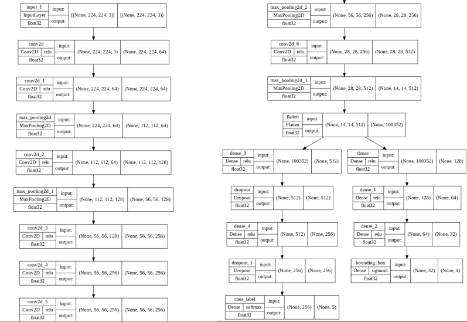
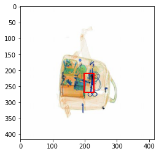

# Prohibited-Items-Detection

Airports keep striving to automate technologies and detection processes to improve performance while reducing scanning and image processing times and human error, and using artificial intelligence algorithms that do not have human weaknesses could be a valuable assistant to human operators and the first step toward fully automating airport security checkpoints.
Besides, from detecting and classifying objects such prohibited items may become increasingly important in airport security. 

This project detects and classifies prohibited Items in x-ray images.
It showcases the details of an AI algorithm based on the CNN model, which is  explained here.

After training our model, our test provides 70% accuracy with the test dataset,and this x-ray image serves as an illustration of prohibited object detection.

This model can be improved and optimized to produce more accurate results. 
